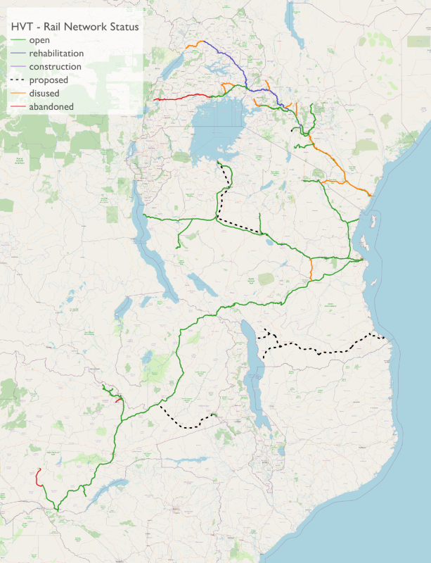

# East Africa Rail Data

## Summary of methodology

* Starting data were geopackages for each country (Kenya, Tanzania, Uganda, and Zambia) containing a rail 'network' consisting of nodes and edges extracted from OpenStreetMap data using [this script](https://github.com/nismod/east-africa-transport/blob/main/preprocess/rail/rail.sh).
* The edges and node features for each country were reviewed in QGIS
* The edge and node features were then imported as tables into a PostgreSQL spatial database (with postGIS and pgRouting extensions)
* All subsequent processing was carried out using SQL queries (and blocks of procedural code). There is a commented SQL file for each country which will recreate the processed data from the original geopackage files.
* pgRouting was used to identify the edges making up (undirected) routes between key station pairs. Attributes were then assigned to these edges (for example, name of the line, gauge, and status). 
* The OSM data was not fully routable, and it was necessary to split some lines at existing nodes
* As there are often multiple lines through stations, the station node was not always on an edge forming the selected route through a station. In this case, either a suitable existing node was reassigned or, a new node was generated on the nearest point of the appropriate edge.
* Nodes and edges for proposed lines were created in QGIS (and the SQL code then exported). Only the following proposed lines where funding has been committed/allocated have been included:
  * Phase 3-5 of the SGR in Tanzania (though note that funding is only currently committed for phase 5).
  * Mtwara to Mbamba SGR Line in Tanzania.
  * Chipata to TAZARA line (at Serenje).
  * Note that phases 2B (Naivasha to Kisumu) and 3 (Kisumu to Malaba) of the Kenyan SGR have been put on hold with investment directed to rehabilitation of the metre gauge railway instead. These phases are therefore not included.
* Two freight gauge interchange facilities have been identified at Kidatu (TAZARA line to metre gauge - *disused*) and the Naivasha Inland Container Depot (SGR to metre gauge - *under construction*). A 'fake' edge has been added to represent each interchange and assigned a 24 hour freight_time cost value.  It is therefore possible to route between gauge via these edges.
* Once the individual countries had been processed a combined network was then generated using the SQL code in [this script](https://github.com/nismod/east-africa-transport/blob/main/data/rail/generate_combined_network.sql).

## Attributes

### Network

- oid (integer) - unique ID (PK)
- country (text)
- source (integer) - OID of the source node of this edge (for routing)
- target (integer) - OID of the target node of this edge (for routing)
- length (float) - length in metres of the edge
- line (text) - name assigned to the line that this edge forms part of. This might be the name by which the line is known locally or origin - destination. 
- status (text) - the status of the line that this edge forms part of (as far as it has been possible to determine):
  - open - the line is open for passenger and/or freight operations
  - rehabilitation - the line is being rehabilitated and is not currently in use
  - construction - the line is being constructed
  - disused - a line that is thought to be largely intact but is not currently used
  - abandoned - a line where track and other infrastructure are now missing (and/or built-over) and a complete re-build would be required. 
- gauge (text) - the gauge in millimetres of the line that this edge forms part of. Available options are:
  - 1000 (metre gauge)
  - 1067
  - 1435 (standard gauge)
  - 1000 <-> 1067 (assigned to a 'fake' edge indicating the availability of freight gauge interchange facilities)
  - 1000 <-> 1435 (will be assigned to a 'fake' edge indicating the availability of freight gauge interchange facilities)
- mode (text) - the type of traffic on this edge:
  - mixed - passenger and freight - the default assumption
  - freight - if definitively known to be the case).
- structure (text) - identifies if the edge forms part of the following structures:
  - bridge
  - tunnel
  - viaduct
  - NULL
- speed_freight (integer) - the design operating speed for freight (if known). NULL if unknown.
- speed_passenger (integer) - the design operating speed for passengers (if known). NULL if unknown.
- time_freight (float) - the estimated time in minutes for a freight train to traverse the edge. Details are provided in the `generate_combined_network.sql` script file. Note that other than for the SGR lines this is largely based on matrices provided by the World Food Programme for typical freight times between key cities/towns. These times **include** additional allowance for offloading, loading, consolidating, interchange and shunting activities to occur at certain stations.
- comment (text) - additional information
- geom (geometry) - the geometry of the edge (linestring).

### Nodes

Notes that only halts/stops and stations are included in this dataset. 

* oid (integer) - unique ID (PK)
* country (text)
* type:
  * station
  * halt (station without facilities)
  * stop - this is used to identify locations other than stations or halts. For example, ports or inland container ports.
* name (text) - name of the station or facility
* facility - identifies if a particular facility is associated with the station/stop location. Options are:
  * cargo_terminal
  * container_port
  * dry_port
  * gauge_interchange
  * manufacturer
  * mine
  * port
  * quarry
  * refinery
* gauge (text) - gauge of the track in millimetres that this station/stop serves
* geom (geometry) - geometry of the feature (point)

## Using the network

As the network includes lines that have a different status, edges should be selected/removed as required prior to routing. For example, if routing only on current open lines is required, then edges with the status 'open' would be selected to represent the graph.

